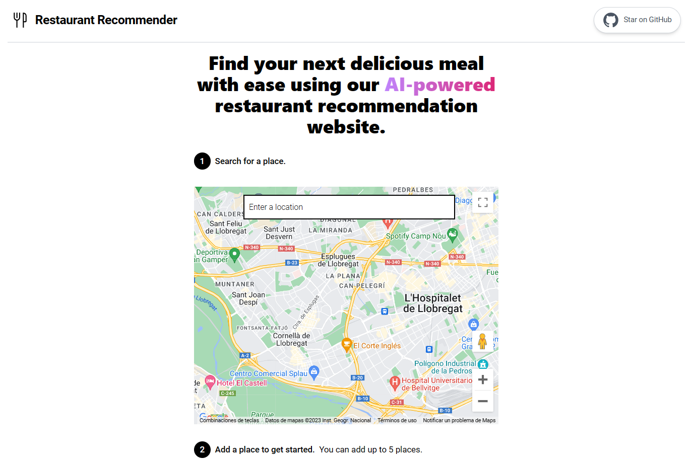

# [Restaurant Recommender](https://www.restaurant-recommender.com)

This project generates restaurant recommendations based on your preferences. It uses the [OpenAI GPT-3 API](https://openai.com/api/) (specifically, text-davinci-003) and [Vercel Edge functions](https://vercel.com/features/edge-functions) with streaming. It constructs a prompt based on the form and user input, sends it to the GPT-3 API via a Vercel Edge function, then streams the response back to the application.

[](https://www.restaurant-recommender.com)

## Running Locally

After cloning the repo, go to [OpenAI](https://beta.openai.com/account/api-keys) to make an account and put your API key in a file called `.env`.

Also need Google Maps API key `GOOGLE_MAPS_API_KEY` in `.env`.

Then, run the application in the command line and it will be available at `http://localhost:3000`.

```bash
vercel dev
```

## One-Click Deploy

Deploy the example using [Vercel](https://vercel.com?utm_source=github&utm_medium=readme&utm_campaign=vercel-examples):

[](https://vercel.com/new/clone?repository-url=https://github.com/HolaSoyGonZzA/restaurant-recommender&env=OPENAI_API_KEY&env=GOOGLE_MAPS_API_KEY&project-name=restaurant-recommender&repo-name=restaurant-recommender)
